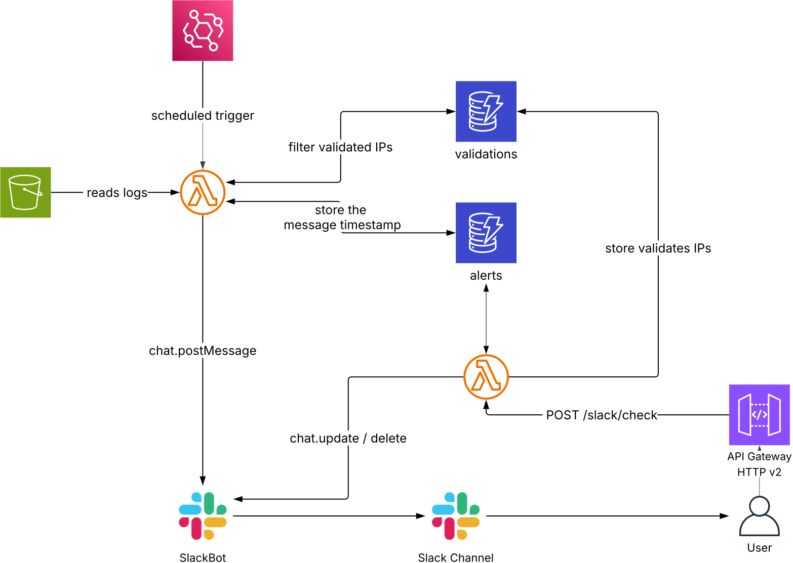

# ELB Anomaly Detection — Arquitectura Serverless AWS

Sistema serverless de monitorización de seguridad que analiza automáticamente los logs de un Application Load Balancer (ALB) de AWS cada día, detecta IPs sospechosas mediante análisis de patrones de comportamiento y notifica al equipo de seguridad a través de mensajes interactivos en Slack.

## Diagrama de arquitectura

```
EventBridge (cron diario) ──► Lambda Detector ──► S3 (lee logs ALB)
                                               ──► DynamoDB validations (filtra IPs conocidas)
                                               ──► DynamoDB alerts (guarda estado + ts)
                                               ──► Slack (chat.postMessage)

Botón Check en Slack ──► API Gateway HTTP v2 ──► Lambda Responder
                                               ──► DynamoDB alerts (marca checkeada)
                                               ──► DynamoDB validations (guarda permanentemente)
                                               ──► Slack (chat.update / chat.delete)
```

## Patrones de detección

| Patrón | Umbral | Puntuación |
|---|---|---|
| P1 — Tasa de peticiones alta | Pico >100 req/min desde una misma IP (mín. 30 req totales) | 2 |
| P2 — Velocidad de máquina | 60+ peticiones consecutivas a ≤2s de intervalo | 2 |
| P3 — Tasa de errores alta | >20% de respuestas 4xx/5xx desde una misma IP | 2 |
| P4 — Escaneo de rutas | 10+ rutas únicas solicitadas (posible enumeración) | 2 |
| P5 — Sondeo de URLs de administración | Cualquier petición a rutas admin que devuelva HTTP 200 | 5 |

Puntuación mínima para alertar: **4**. P5 siempre genera alerta independientemente del resto.

## Recursos AWS desplegados

| Recurso | Nombre | Descripción |
|---|---|---|
| S3 | `elb-anomaly-demo-logs` | Almacena los logs ALB |
| DynamoDB | `elb-anomaly-alerts` | Estado de alertas diarias con TTL de 7 días |
| DynamoDB | `elb-anomaly-validations` | IPs validadas permanentemente (sin TTL) |
| Lambda | `elb-anomaly-detector` | Analiza logs, detecta patrones, notifica en Slack |
| Lambda | `elb-anomaly-responder` | Gestiona el callback del botón Check de Slack |
| EventBridge | `elb-anomaly-daily-detection` | Dispara el detector cada día a las 01:00 UTC |
| API Gateway | `elb-anomaly-slack-callback` | Recibe callbacks interactivos de Slack |
| CloudWatch Logs | `/aws/lambda/elb-anomaly-*` | Logs de ambos Lambdas con retención de 7 días |

## Estructura del proyecto

```
├── lambdas/
│   ├── detector.py          # Lambda: análisis diario de logs y notificación Slack
│   └── responder.py         # Lambda: gestión del botón Check de Slack
├── terraform/
│   ├── main.tf              # Proveedor y variables locales
│   ├── variables.tf         # Variables de entrada
│   ├── terraform.tfvars.example  # Plantilla de variables sensibles
│   ├── outputs.tf           # Valores de salida
│   ├── s3.tf                # Bucket S3
│   ├── dynamodb.tf          # Tablas DynamoDB
│   ├── iam.tf               # Roles y políticas IAM
│   ├── lambda.tf            # Funciones Lambda
│   ├── eventbridge.tf       # Regla EventBridge programada
│   └── apigateway.tf        # API Gateway HTTP v2
├── .gitignore
└── README.md
```

## Requisitos previos

- AWS CLI configurado con el perfil apropiado
- Terraform >= 1.10.0
- Python 3.12+
- Slack App con Bot Token y Signing Secret
  - Scopes necesarios: `chat:write`, `groups:history`, `channels:history`
  - Interactividad habilitada en la app

## Despliegue

### 1. Configurar variables

```bash
cp terraform/terraform.tfvars.example terraform/terraform.tfvars
```

Edita `terraform/terraform.tfvars` con tus credenciales de Slack:

```hcl
slack_bot_token      = "xoxb-..."
slack_signing_secret = "..."
slack_channel_id     = "C..."
```

### 2. Desplegar la infraestructura

```bash
cd terraform
terraform init
terraform plan
terraform apply
```

### 3. Configurar Slack Interactivity

Copia el output `api_gateway_url` y pégalo en:
**api.slack.com/apps → Tu App → Interactivity & Shortcuts → Request URL**

### 4. Destruir la infraestructura

```bash
cd terraform
terraform destroy
```

## Seguridad

- Los roles IAM siguen el principio de mínimos privilegios — cada rol solo tiene permisos sobre sus recursos específicos
- Los callbacks de Slack se verifican mediante firma HMAC-SHA256 con el Signing Secret
- Protección anti-replay: se rechazan peticiones con más de 5 minutos de antigüedad
- API Gateway con throttling: 10 req/s sostenidas, burst de 20
- Todos los valores sensibles se marcan como `sensitive = true` en Terraform

## Stack tecnológico

`AWS Lambda` · `Amazon S3` · `Amazon DynamoDB` · `Amazon EventBridge` · `Amazon API Gateway` · `Terraform` · `Python 3.12` · `Slack Block Kit`

## Demo del Proyecto

### Captura de pantalla


### Video demostrativo
<div align="center">
  <video src="slack_project_video.mp4" width="100%" controls muted autoplay loop>
    Tu navegador no admite el elemento de video.
  </video>
</div>
